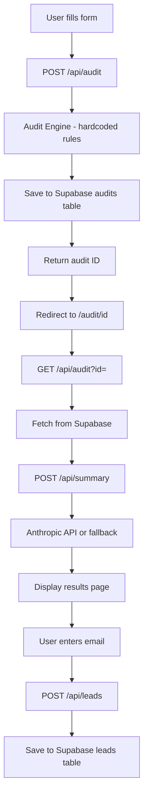

# Architecture

## System Diagram

## Data Flow

1. User fills in tools, plans, seats, monthly spend on homepage
2. Clicks "Run My Free Audit" → POST to /api/audit
3. Audit engine runs hardcoded rules against pricing data
4. Result saved to Supabase audits table with unique ID
5. User redirected to /audit/[id]
6. Page fetches audit from Supabase via GET /api/audit?id=
7. Page calls /api/summary which hits Anthropic API
8. If Anthropic fails, fallback template summary is used
9. User can enter email → saved to leads table in Supabase

## Why This Stack

- **Next.js** — API routes + React in one framework, perfect for small full-stack apps
- **TypeScript** — Catches bugs at compile time, especially important for audit math
- **Supabase** — Free tier, Postgres, instant REST API, easy to set up in days
- **Vercel** — Zero config deployment for Next.js, auto-deploys on git push
- **Tailwind CSS** — Fast styling without leaving the component file

## Scaling to 10k Audits/Day

- Add Redis caching for audit results so Supabase isn't hit on every page load
- Move audit engine to an edge function for lower latency
- Add a job queue (like Inngest) for AI summary generation instead of blocking
- Enable Supabase connection pooling via PgBouncer
- Add CDN caching for the results page since most data is static after creation